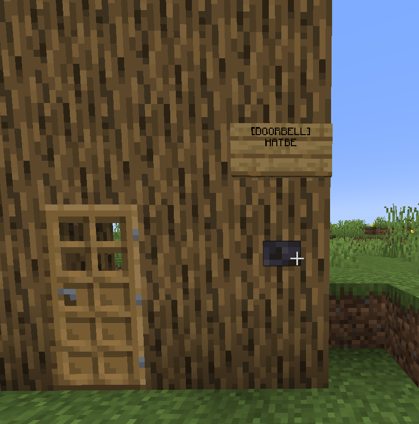
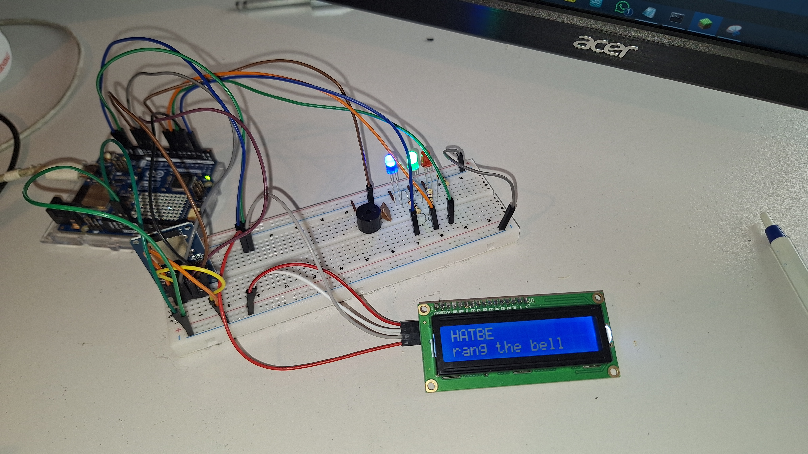

# Minecraft "Real" Doorbell

This project allows a physical Arduino-based device to ring when a player presses a doorbell button in Minecraft. It showcases the interaction between physical computing and virtual game worlds via WiFi/TCP communication and a custom Minecraft plugin.


# How its build

## Hardware


### Parts used

| Part            | Name                                | Link                                                                                                                                                                                                                                                                                                                                                                                                                                                                                                                                                                                                                                                       |
| --------------- | ----------------------------------- | ---------------------------------------------------------------------------------------------------------------------------------------------------------------------------------------------------------------------------------------------------------------------------------------------------------------------------------------------------------------------------------------------------------------------------------------------------------------------------------------------------------------------------------------------------------------------------------------------------------------------------------------------------------- |
| Microcontroller | Arduino Uno R4 WiFi                 | [https://www.digitec.ch/de/s1/product/arduino-uno-r4-wifi-entwicklungsboard-kit-36704956](https://www.digitec.ch/de/s1/product/arduino-uno-r4-wifi-entwicklungsboard-kit-36704956)                                                                                                                                                                                                                                                                                                                                                                                                                                                                         |
| Card Reader     | Purecrea Micro SD Card Reader Modul | [https://www.digitec.ch/de/s1/product/purecrea-micro-sd-card-reader-modul-entwicklungsboard-zubehoer-36359709](https://www.digitec.ch/de/s1/product/purecrea-micro-sd-card-reader-modul-entwicklungsboard-zubehoer-36359709)                                                                                                                                                                                                                                                                                                                                                                                                                               |
| Speaker         | 5V Beeper                           | [https://de.aliexpress.com/item/1005006824320094.html](https://de.aliexpress.com/item/1005006824320094.html?spm=a2g0o.productlist.main.4.5b0bjhU3jhU3x3&aem_p4p_detail=20250509024448886241642425440001656126&algo_pvid=cd254ae2-5c61-45f2-8247-cbb69b813e81&algo_exp_id=cd254ae2-5c61-45f2-8247-cbb69b813e81-3&pdp_ext_f=%7B%22order%22%3A%22121%22%2C%22eval%22%3A%221%22%7D&pdp_npi=4%40dis%21CHF%212.03%212.03%21%21%2117.34%2117.34%21%40211b629217467838888196531ebde2%2112000038424676341%21sea%21CH%211880405112%21X&curPageLogUid=7vv8quVON0ta&utparam-url=scene%3Asearch%7Cquery_from%3A&search_p4p_id=20250509024448886241642425440001656126_1) |
| LEDs            | LED GREEN, RED, BLUE                | [https://de.aliexpress.com/item/1005003323707856.html](https://de.aliexpress.com/item/1005003323707856.html)                                                                                                                                                                                                                                                                                                                                                                                                                                                                                                                                               |
| Resistors       | 200 OHM, 100 OHM                    | [https://de.aliexpress.com/item/1005005855324735.html](https://de.aliexpress.com/item/1005005855324735.html?spm=a2g0o.productlist.main.1.124712ec0VHXa0&algo_pvid=e63cf3f5-2515-49e1-8fb4-8c928c8522dc&algo_exp_id=e63cf3f5-2515-49e1-8fb4-8c928c8522dc-0&pdp_ext_f=%7B%22order%22%3A%221724%22%2C%22eval%22%3A%221%22%7D&pdp_npi=4%40dis%21CHF%212.00%211.95%21%21%212.36%212.30%21%402103835c17467839483137811e7b8d%2112000034587357832%21sea%21CH%211880405112%21X&curPageLogUid=bdIRow2lOtXH&utparam-url=scene%3Asearch%7Cquery_from%3A)                                                                                                               |
| Cables          | MtM, FtM, FtF                       | [https://de.aliexpress.com/item/1005006996497323.html](https://de.aliexpress.com/item/1005006996497323.html)                                                                                                                                                                                                                                                                                                                                                                                                                                                                                                                                               |
| LCD             | LCD1602+I2C BLUE                    | [https://de.aliexpress.com/item/1005006964073869.html](https://de.aliexpress.com/item/1005006964073869.html)                                                                                                                                                                                                                                                                                                                                                                                                                                                                                                                                               |

### Pinout

| PIN Arduino UNO R4 Wifi | Device         | PIN Device |
| ----------------------- | -------------- | ---------- |
| SCL                     | LCD            | SCL        |
| SDA                     | LCD            | SDA        |
| GND                     | LCD            | GND        |
| 5V                      | LCD            | VCC        |
| 2                       | BLUE LED       | (+) 100 Ω  |
| GND                     | BLUE LED       | (-)        |
| 5                       | RED LED        | (+) 200 Ω  |
| GND                     | RED LED        | (-)        |
| 6                       | GREEN LED      | (+) 100 Ω  |
| GND                     | GREEN LED      | (-)        |
| 7                       | SPEAKER        | (+)        |
| GND                     | SPEAKER        | (-)        |
| 4                       | SD CARD READER | CS         |
| 11                      | SD CARD READER | MOSI       |
| 12                      | SD CARD READER | MISO       |
| 13                      | SD CARD READER | SCK        |
| GND                     | SD CARD READER | GND        |
| 5V                      | SD CARD READER | VCC        |

## Software

This Project uses:

- A Custom Minecraft (Paper) Plugin (doorbell.jar) written in (Java)
- An Arduino Sketch written in (Arduino c++)

You can find all the files in this repo

/hw-client/client/client.ino

/minecraft-plugin/src/java/ch/hatbe/minecraft/DoorbellPlugin.java

# Setup Instructions

## Minecraft server setup

### Install on Windows

1. Download the 1.21 JAR form https://papermc.io/downloads/paper
2. Creata a new folder for the Server "mc"
3. Copy the paper-1.21.jar to mc/server.jar
4. Cretae a new file called mc/eula.txt (first read the eula: https://www.minecraft.net/en-us/eula!) with the content:

```text
eula=true
```

5. Create a file called start.bat with the content:

-Xmx = Maximum RAM, currently 4 GB, you can change this to whatever you want

-nogui = dont start the minecraft GUI, use just the terminal

```batch
@echo off

java -Xms4G -jar paper.jar -nogui

pause
```

6. Copy the doorbell.jar (Plugin, get from Github) into mc/plugins/doorbell.jar
7. Start the server with a click on "start.bat"

Install video: https://www.youtube.com/watch?v=i7A9g2tRrmw

### Install on Linux

https://www.youtube.com/watch?v=HianD9RWXJs

## Register the HW client

On Minecraft server

1. Type /clientregister in the chat
2. Copy the the password (by clicking on it) in the CONF file as described in the following section.

## HW Client

Build the HW Client like mentioned at the HARDWARE Section above or use the Live Streams or the Showcase Video on Youtube.

### SD Card

1. Format a SD Card with FAT32
2. Upload the "CONF" file
3. Change your data

```json
{
  "WIFI": {
    "SSID": "your SSID",
    "PASSWORD": "your wifi Password"
  },
  "MC": {
    "HOSTNAME": "host.name",
    "PORT": 1337,
    "USERNAME": "minecraft username",
    "CLIENTPASSWORD": "generated password"
  }
}
```

4. Insert the SD Card in the SD Card slot of the HW Client

### Start

Add a USB C cablke to the Arduino UNO r4

At first there is a little startup section where all the components get tested (led, buzzer, screen).

Then it should show a green LED that means, everithing is ok with the TCP / WIFI connection.

When its RED, read the error message from the screen.

## Create the doorbell

1. Place a button on the wall
2. Place a sign above the button with the content:

```text
[DOORBELL]
USERNAME
```



## Ringing

Click the button and Ring the bell (if there is a hw client connected)



The client should now make a RING sound with the Speaker and on the Screen, there is the Name of the minecraft Player that has rung the doorbell.

# How does the ringing work?

When a hardware client powers up, it reads its configuration from the SD card, verifies everythings in order, enables Wi-Fi, and initiates a TCP connection to the Minecraft server (The plugin opens that connection).

Next, it sends a LOGIN packet containing the username and password stored on the SD card.

The Minecraft server plugin checks whether the provided username exists and whether the password matches. If the credentials are valid, the plugin maintains an open connection with the client and adds it to a list of active clients. (Yes, multiple hardware clients are supported and expected. (so all your friends (that you dont have) can have their own doorbells.))

When someone presses the doorbell button in Minecraft:

- The plugin checks its list of connected hardware clients.

- If a client is connected for that player, it sends a RING packet over TCP with the username of the person who pressed the button.

- The corresponding Arduino rings the bell, flashes the blue LED, and displays the username on the LCD.

After ringing, that hardware client enters a cooldown period of 20 seconds, shared across all users connected to that specific doorbell.

# Sources and Credits

Credit Number one goes to: https://chatgpt.com

Idea from: https://www.instagram.com/p/DG0lkkGK2IP/

# Demonstrations & BuildLog

Building Live Streams (from me):

- (1) https://www.youtube.com/watch?v=lB1JgAwDldU
- (2) https://www.youtube.com/watch?v=wGNBEYpEY5w
- (3) https://www.youtube.com/watch?v=8lvhf5U1ZYo
- (4) https://www.youtube.com/watch?v=lCVEudTW93s
- (5) https://www.youtube.com/watch?v=QGFq3GIfsu4
- (6) https://www.youtube.com/watch?v=AjfCAAao004

Showcase Video (from me): TODO:

Showcase Short (from me): TODO:
